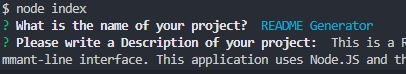
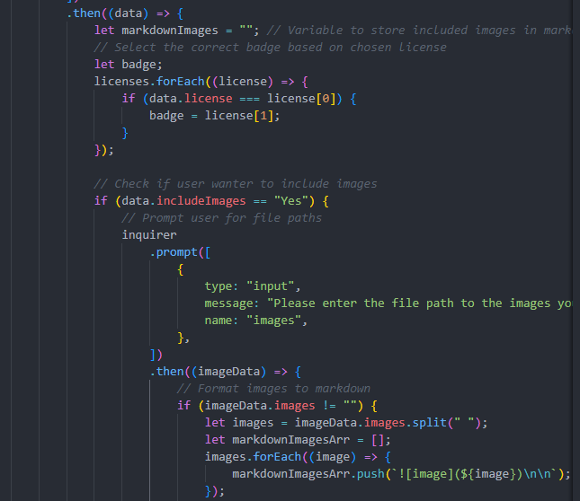

# README Generator

## Description

This is a README generator written in Javascript. It is designed to produce a high quality README file populated with data given by the user in the form of prompts via the commant-line interface. This application uses Node.JS and the inquirer library. Below is an image demonstrating the script and an image showing some of the code.

## Table of Contents

[Installation](#installation)

[Usage](#usage)

[License](#license)

[Contributing](#contributing)

[Contributing](#contributing)

## Installation

To install this application, clone the repository, navigate your terminal to the same directory as `package.json` and run `npm install package.json` in the terminal.

## Usage

To user this application, make sure you are in the same directory as `index.js`, open your terminal and run `node index`. You will then be presented with a series of prompts, follow the prompts and a README file will be generated.

## License

MIT

## Contributing

To contribute please submit a pull request for review.

## Tests

Tests have been conducted to alleviate any issues with data, for example, when the user enters nothing or when they attempt to enter a "bad" string. Feel free to test the application and report and bugs or errors you may encounter.

## Questions

If you have any questions please contact me via the email or via my GitHub account below.

notanemail@gmail.com

SatsumaSegment
